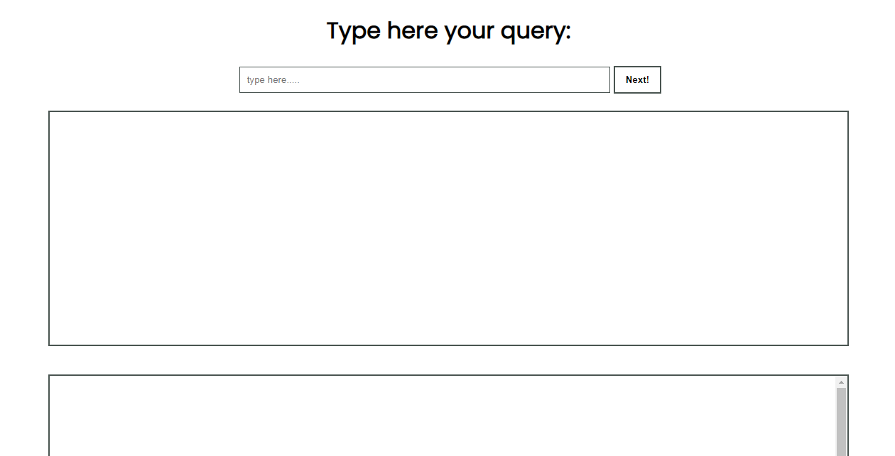

# Hello there,

This is very simple but smart CSS Frontend layout code generator!

# What's actually is this?

This is a tool that takes englishh queries text basically for any non web developer and outputs the CSS Code or TailwindCSS Code layout for that query.

# What the idea behind?

Well , i was just exploring some GPT -3 Apps that takes in basic english text output and generates code but that hack is GPT -3 Api access!

Its not that easy to gain the access also running it might be costlty.

But this is something out from the crowd that uses no GPT or any other language model.

Instead it uses NLP based search and brings out the most accurate output.


# Introduction

 
Currently it generates all the basic CSS Layouts that are possible!
Including CSS Flexbox , text , containers , responsive layouts etc.


# PREVIEW

This is how the interface looks like & is powered by FLASK simple yet efficient!



# Syntax

Basically just type your query as if you are asking to your friend like in plain english 

> INPUT: Give me button

OUTPUT: ```html
 <button class='__tailwindCSS Classes__'>button</button> ```


# Docs 

I guess this is not required.
but still Documentation is in development process for developers.

# Notice

This project is ongoing currently and is in development will be released soon!

Email me if you like to contribute on this.
